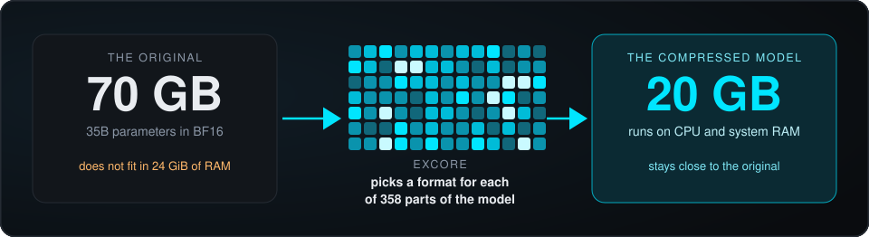
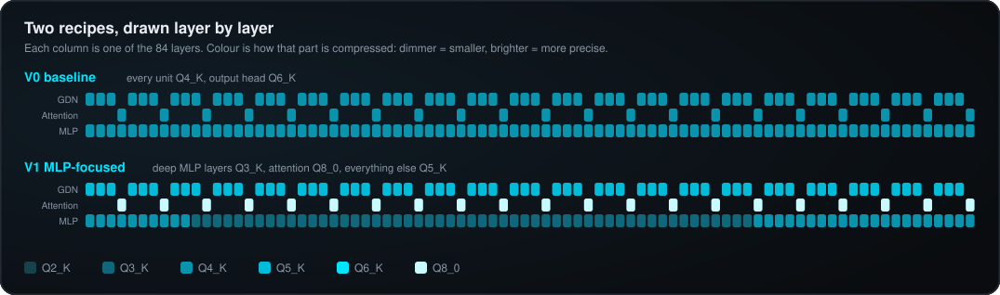
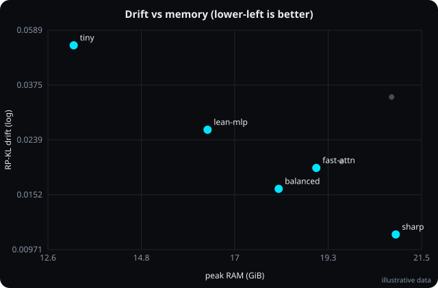
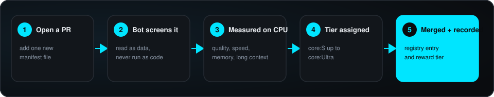
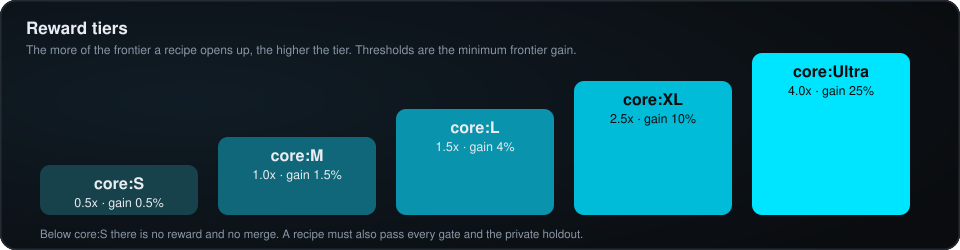
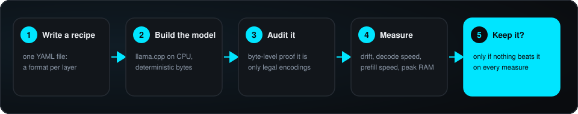

<p align="center">
  
</p>

<p align="center">
  <a href="https://github.com/ikeige-coder/eXCore/actions/workflows/ci.yml"></a>
  
  
  
  
  
</p>

<p align="center">
  <a href="#the-problem">Problem</a> ·
  <a href="#what-excore-does">What it does</a> ·
  <a href="#mine-it">Mine it</a> ·
  <a href="#how-it-works">How it works</a> ·
  <a href="#requirements">Requirements</a> ·
  <a href="#docs">Docs</a>
</p>

> **eXCore automatically searches for the best way to compress a large language model so that it runs on a
> CPU, while keeping as much of the original model's quality as possible.**

## The problem

A 35B-parameter model needs about **70 GB** as released. Ordinary machines have a fraction of that, and no
GPU. So the model must be **compressed** (quantized) into formats like `Q4_K` or `Q8_0`. It then fits, but it
no longer answers *exactly* like the original.

<p align="center">
  
</p>

The usual approach applies one recipe everywhere:

```
layer 1 → Q4_K    layer 2 → Q4_K    …    layer 84 → Q4_K
```

But layers are not equal. Some shrug off compression and some lose quality. So the real question is:

**What is the best compression recipe for this exact model on a CPU?**

Most optimization networks answer it on a single class of expensive GPU, which keeps participation thin.
eXCore runs the whole evaluation on **CPU and system RAM**, so anyone can take part: a recipe is a short YAML
file, and miners never download the model, quantize anything, or own a GPU.

## What eXCore does

It takes recipes, builds each into a real model, and measures it on a real CPU. Each column below is one
layer; the colour is how that part is compressed.

<p align="center">
  
</p>

Every candidate answers four questions, and only the best trade-offs survive:

| | Question | Why it matters |
|---|---|---|
| 1 | **How close is it to the original model?** | the quality you keep |
| 2 | How fast does it generate text? | chat and agent speed |
| 3 | How fast does it read a long prompt? | time to first token |
| 4 | How much RAM does it need? | what fits |

**A win looks like this:** the same speed and memory with a model that behaves more like the original, or
less memory at the same quality, or a better overall balance. eXCore is not mainly a speed project. It is
about keeping quality while fitting the hardware.

Candidates are placed on a **four-dimensional Pareto frontier**: the set of models nothing else beats on every
measure at once.

<p align="center">
  
</p>

## Mine it

You don't write inference code. You submit a better recipe for the model, and the registry rewards it when it
merges.

<p align="center">
  
</p>

1. **Write a recipe**, `manifests/<name>.yaml`.
2. **Open a pull request** that adds exactly that one new file.
3. **The evaluator bot** reads it as data, builds and audits the model, measures it, and comments with the score.
4. **Get a tier.** If the recipe pushes the frontier and passes every gate, the bot merges it and records it.

<p align="center">
  
</p>

| Tier | Frontier gain | Multiplier |
|---|---|---|
| `core:Ultra` | at least 25% | 4.0x |
| `core:XL` | at least 10% | 2.5x |
| `core:L` | at least 4% | 1.5x |
| `core:M` | at least 1.5% | 1.0x |
| `core:S` | at least 0.5% | 0.5x |
| none | below 0.5%, dominated, or failed a gate | no reward, no merge |

Measurement noise cannot buy a place: a new recipe is scored conservatively and must beat an incumbent by more
than the benchmark's own margin. A recipe must also survive a **private, rotating holdout** and a
**long-context check at 8K and 16K tokens**, so it cannot be tuned to the public data or quietly break long
context to save memory. Multipliers are the proposed values; what a tier pays depends on the network the
repository is registered with.

Recipes the repository owner merges by hand are evaluated and recorded the same way, and the owner can approve
a recipe the frontier rejected. The gates and the holdout can never be overridden.

**Start here:** [Miner guide](docs/miner_guide.md) · [Scoring](docs/core_frontier.md) · [Precision space](docs/precision_space.md)

### Try it without a GPU

```bash
git clone https://github.com/ikeige-coder/eXCore && cd eXCore
pip install -e ".[dev]"
pytest -q                                        # build, audit, tamper detection, RP-KL, frontier, bot

excore check experiments/base_variants/V1_mlp_focused.yaml   # is a recipe legal, and roughly how big?
```

A recipe is a few lines of YAML:

```yaml
schema: excore/manifest@1
track: CPU-35B
name: mlp-squeeze
default: Q5_K                    # every unit starts here
rules:                           # later rules override earlier ones
  - { match: "L*.mlp",    format: Q4_K }
  - { match: "L*.mlp",    layers: "10-62", format: Q3_K }
  - { match: "L*.attn.*", format: Q8_0 }
  - { match: "lm_head",   format: Q6_K }
```

---

## How it works

<p align="center">
  
</p>

The bot treats a pull request as **data, never as code**. It reads the recipe as text, parses it with a strict
parser, and builds the model itself, so a submission cannot run anything on the validator. The build is
deterministic, and an audit proves the result is nothing but legal encodings of the hash-locked source weights.

### The track: CPU-35B

| | |
|---|---|
| Model | 35B parameters: 84 layers, 63 Gated DeltaNet + 21 full attention; BF16 weights hash-locked |
| Search space | **358 units** × GGUF format (`Q2_K` to `Q8_0`, `F16`, `BF16`) × quantizer |
| Runtime | llama.cpp at a pinned commit, CPU only, fixed thread count |
| Fidelity | **Reference-Partition KL** against the BF16 original on a hash-locked corpus |
| Objectives | drift ↓ · decode tokens/s ↑ · prefill tokens/s ↑ · peak RAM ↓ |
| Gates | stable benchmark · peak RAM ≤ 24 GiB · long-context 8K / 16K · private holdout |
| Frozen | architecture, tokenizer, every non-searchable tensor, the BF16 source |

Everything is pinned in `configs/hpc_cpu.yaml` and `configs/sources.lock.json`.

### Key terms

| Term | Meaning |
|---|---|
| **Unit** | The smallest piece whose format a recipe can choose: `L7.attn.q`, `L40.gdn.z`, `L12.mlp`, `lm_head`. There are 358. |
| **Manifest** | A few lines of YAML assigning a format to every unit. It *is* the submission. |
| **Quantizer** | What produces a unit's bytes: `runtime` (llama.cpp's encoders) or `rtn` (round-to-nearest, replayable byte for byte). |
| **Audit** | Proof that a built model is nothing but legal encodings of the locked weights. |
| **RP-KL** | How far next-token predictions drift from the original, measured on its top-256 tokens plus a tail bucket. Never larger than the full KL. |
| **Frontier gain** | The share of the quality × speed × memory space a recipe adds. It decides the tier. |

### Tracks

| Track | Model | Status |
|---|---|---|
| eXCore | 27B | base engine, config kept in `configs/tracks/` |
| **eXCore-v1** | **35B** | **current** |
| eXCore-v2 | 70B | planned |

---

## Requirements

**Miners**

| | |
|---|---|
| Software | Python 3.10 or newer, on any operating system |
| Hardware | any machine; no GPU, and no model weights to download |
| Tools | `pip install -e .` then `excore check` |

**Validator nodes** (run the evaluator)

| | |
|---|---|
| CPU | x86-64 with AVX2, or ARM with NEON; 6 or more cores |
| RAM | 32 GB. A candidate may use at most 24 GiB resident, and a run needs 24 GiB available to start |
| Disk | about 130 GB free |
| OS | Linux, or Windows with WSL2 |
| Time | plan on 3 to 5 hours per candidate |

**Reference machine** (used once to build the reference distributions): 96 GiB of RAM or more, since the
unquantized BF16 model is about 70 GB. The outputs are small and portable. The full setup is in the
[validator runbook](evaluator/runbook.md).

---

## Docs

| If you want to… | Read |
|---|---|
| start mining | [Miner guide](docs/miner_guide.md) |
| know the legal formats and quantizers | [Precision space](docs/precision_space.md) |
| know how you are scored | [Core-Optimal scoring](docs/core_frontier.md) |
| run a validator node | [Validator runbook](evaluator/runbook.md) |

## Status

The full pipeline (recipe parsing, deterministic builds, byte-level audit, scoring, gating, registry and the
GitHub bot) is implemented and covered by an automated test suite. It is tested against stand-ins for
llama.cpp; the first run on real weights is the final calibration step, described in the runbook. Model
dimensions, the frontier bounds and the tier thresholds ship as documented starting values.

Designed for decentralized, pull-request-based mining networks such as Gittensor.

MIT license · see [LICENSE](LICENSE)
